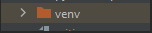
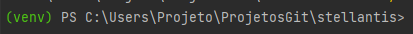
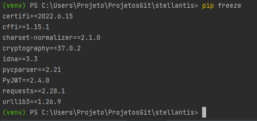

# Projeto Stellants 

## O que sabemos ate agora?

<br>

### End-ponts de teste e end-points de produção

<table border="1">
    
<tr>
<td>Teste</td>
<td>Produção</td>

</tr>
<tr>
<td> https://sts-dev.fiat.com </td>
<td> https://sts.fiatgroup.com </td>

</tr>
<tr>
<td> https://sts-dev.fiat.com/FederationMetadata/2007-06/FederationMetadata.xml </td>
<td> https://sts.fiatgroup.com/FederationMetadata/2007-06/FederationMetadata.xml </td>

</tr>
    
</table>

<br>

### Token Request 

<br>

Acreditamos até agora que o primeiro passo é fazer a requisição de um token enviado para 


<hr>
<br>


## Para simular as requests python:

* Criar ambiente virtual dentro da pasta do projeto usando o comando
     - Este coamando permite que seja criando em seu computador um ambiente virtual que controle as bibliotecas baixadas não gerando lixo no armazenamento de seu computador

``` 
python3 -m venv ./venv 
```

após isso deve aparecer em seu projeto uma pasta assim:
<br>

<hr>
<br>

## Ativando o ambiente em diferentes SO

* Para ativar a venv no Windows usar o seguinte comando
```
venv/Scripts/Activate
```
* Para ativar a venv no Linux usar o seguinte comando
```
source venv/bin/activate
```
<br>
Após isso a linha do terminal deve aparecer com "(venv)" da seguinte forma:


A partir de agora todos os comandos dados no terminal serão realizados aenas no ambiente virtual e não irã afetar seu computador
<hr>
<br>

## Ver bibliotecas já instaladas 

* Para ver as bibliotecas já instaladas usar o comando:
    - o comando deve retornar as bibliocas já instaladas, caso não tenha nenhuma biblioteca instalada o camando não retorna nada
```
pip freeze
```

caso o pip não esteja instalado ver: http://devfuria.com.br/linux/instalando-pip/
mas é bem provavel que já esteja instalado juntamento com o python.
<hr>
<br>


## Instalando bibliotecas 

bibliotecas utilizadas até agora:

```
pip install requests
```
```
pip install PyJWT  
```
```
pip install cryptography
```

se executar agora o comando `pip freeze` o resultado deve ser parecido:
<br>

